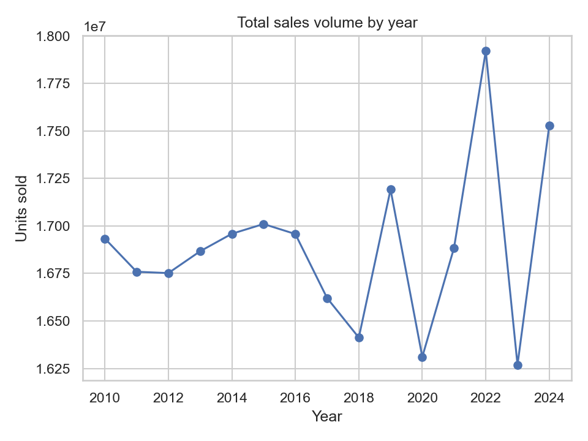
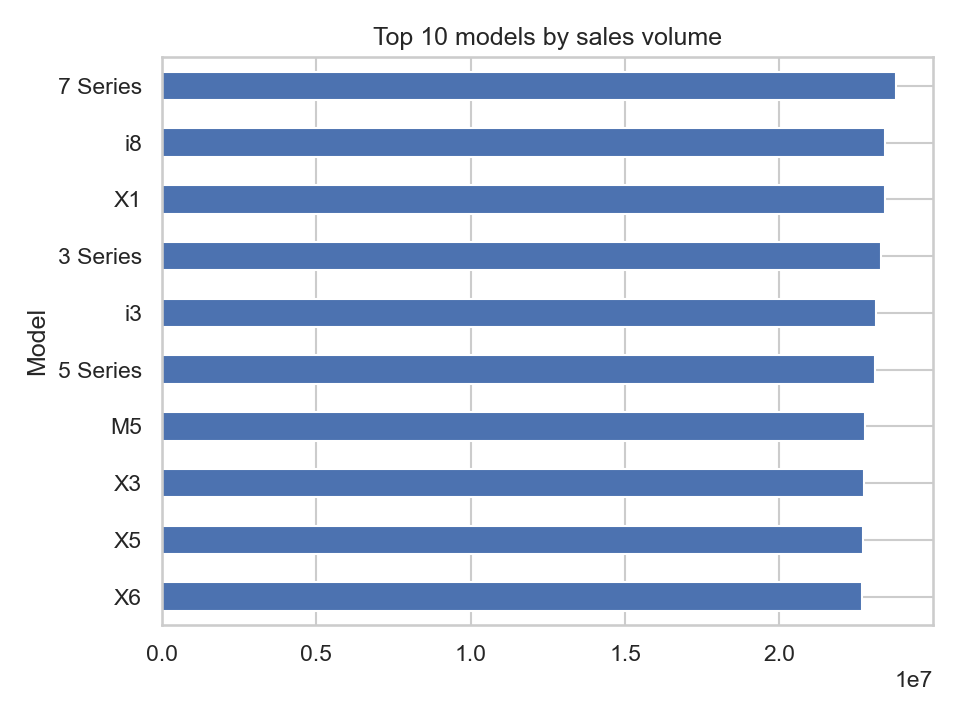
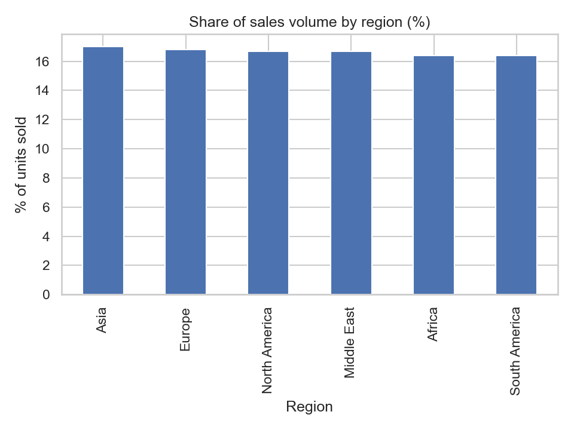
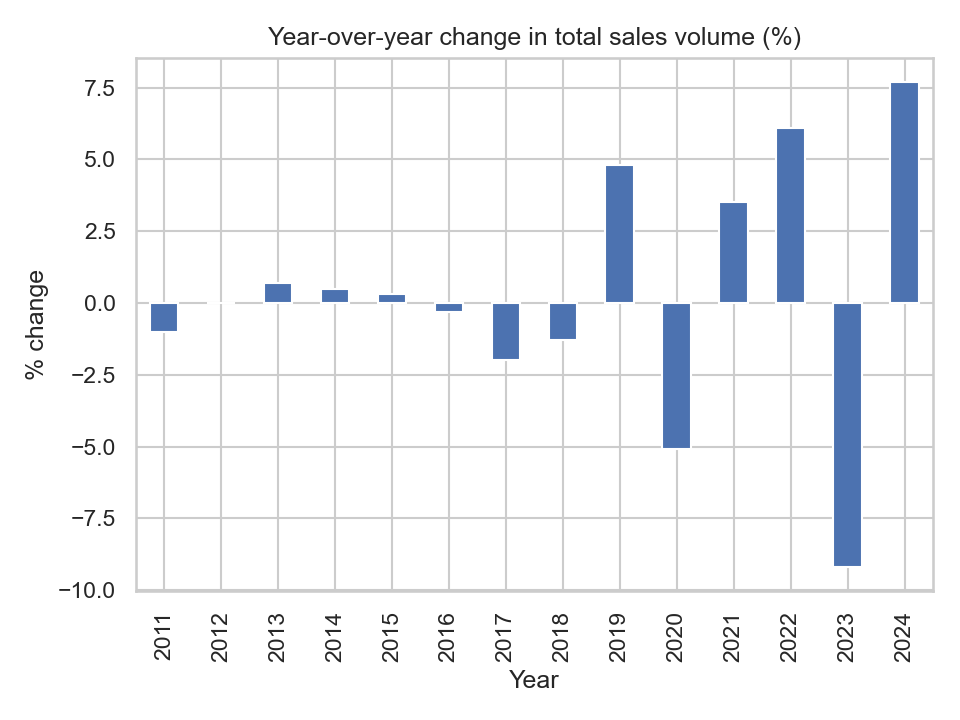
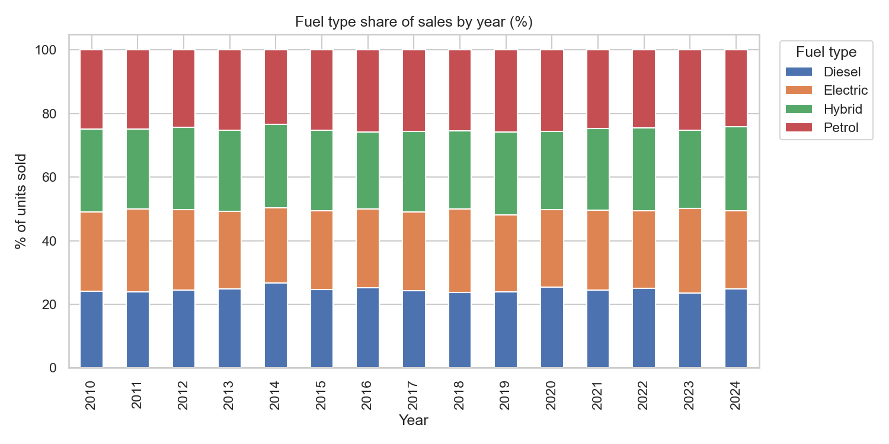
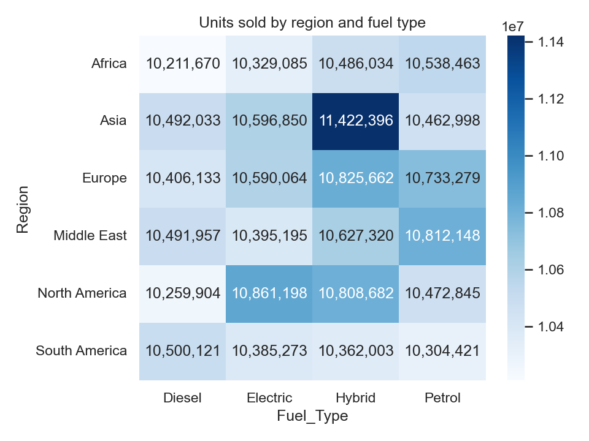

# BMW Sales Data Analysis (2010–2024)

Exploratory data analysis of global BMW sales using **Python, NumPy, pandas, matplotlib and seaborn**. The project looks at which regions and models lead, how fuel types shift over time, and whether price, engine size or mileage drive sales.

## Dataset

- Source: Kaggle, *BMW Sales Data 2010–2024*
- 50,000 rows, 11 columns, no missing values and no duplicate rows
- Columns: `Model`, `Year`, `Region`, `Color`, `Fuel_Type`, `Transmission`, `Engine_Size_L`, `Mileage_KM`, `Price_USD`, `Sales_Volume`, `Sales_Classification`

## Questions

1. Which regions and models lead in sales volume and revenue?
2. How does the share of each fuel type change from 2010 to 2024?
3. Do price, engine size or mileage influence sales volume?
4. Are the differences between regions statistically meaningful?

## Analysis steps

1. **Load and inspect:** shape, data types, summary statistics
2. **Clean:** check missing values and duplicates, standardize text columns
3. **Feature engineering (NumPy):** `Revenue_USD` (price × units sold) and `Price_per_Liter`
4. **Aggregations:** sales by year, region and model
5. **Visualizations:** trends, rankings, shares and a heatmap
6. **Leaders:** share of total units by region and model, top model per region, revenue leaders
7. **Fuel type shift:** yearly share table, change in percentage points, 100% stacked bars, region × fuel heatmap
8. **Growth and checks:** year-over-year change, average price, sales classification by region, one-way ANOVA

## Charts

| | |
|---|---|
|  |  |
|  |  |
|  |  |

## Key findings

- **Regions:** Asia leads with about 43.0M units (17.0% of the 253.4M total), but the gap to the lowest region (South America, 41.6M) is only about 3.4%. No region dominates.
- **Models:** the 7 Series is the top model (23.8M units), yet the top five models are within about 2.8% of each other.
- **Drivers of sales:** price, engine size and mileage show almost no correlation with sales volume (all correlations below 0.01 in absolute value).
- **Trend:** total yearly sales stayed between 16.3M and 17.9M units from 2010 to 2024, with no clear long-term growth or decline.
- **Pricing:** average price is almost identical across fuel types ($74.8K–$75.3K) and across the top five models ($75.3K–$75.6K), a spread of under 1%.
- **Sales classification:** the share of "High" sales is between 29.9% and 31.3% in every region.
- **Statistical check:** a one-way ANOVA on sales volume across regions gives F = 0.87 and p = 0.503, so the regional differences are not statistically significant.

The distributions are very even and the ANOVA confirms it: no single region, model or feature stands out. The data behaves like evenly spread data, so it should not be used for conclusions about BMW's real market.

## Repository structure

```
├── data_analysis.ipynb              # full analysis notebook
├── BMW_sales_data_2010-2024.csv     # dataset
└── vizzes/                          # exported charts
    ├── sales_by_year.png
    ├── top_models.png
    ├── region_share.png
    ├── yoy_change.png
    ├── fuel_share_stacked.png
    └── region_fuel_heatmap.png
```

## How to run

1. Install the libraries: `pip install numpy pandas matplotlib seaborn scipy jupyter`
2. Clone this repository and open `data_analysis.ipynb` in Jupyter
3. Run all cells from top to bottom

## Tools

Python · NumPy · pandas · matplotlib · seaborn · SciPy · Jupyter Notebook
